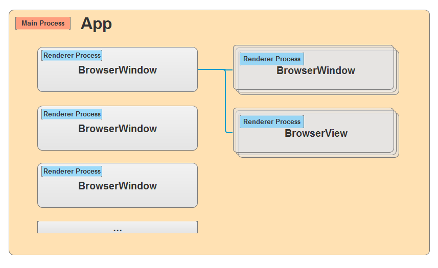

要了解Electron的进程间通信，就得先弄清楚Electron的窗口和线程的概念。

## Electron 的窗口

Electron 用窗口承载Web页面，分别是 BrowserWindow 和 BrowserView。实际上背后都是 Chromium。

**BrowserWindow**：Electron 主要通过 BrowserWindow 来展示Web页面。
  
  
**BrowserView**：BrowserView 用来让 BrowserWindow 嵌入更多的Web内容，它就像一个子窗口，父窗口是 BrowserWindow。

## Electron 的主进程和渲染进程

**主进程**：

> 一个 Electron 应用总是有且只有一个主进程，主进程创建 BrowserWindow 和 BrowserView 来展示Web页面。

**渲染进程**：

> 渲染进程负责实际运行Web页面，每个 BrowserWindow 和 BrowserView 都在自己的渲染进程中运行Web页面。

这里有几点需要注意的：

- 主进程是 Electron 的核心进程，负责管理所有Web页面和它们对应的渲染进程。当主进程退出时，所有渲染进程也都直接终止了。

- 所有的 BrowserWindow 和 BrowserView 都在主进程上创建。

- 当一个 BrowserWindow 或 BrowserView 被销毁时，相应的渲染进程也会终止。

- BrowserWindow 可以创建子 BrowserWindow，子窗口的层级将会置于父窗口之上。

- BrowserView 必须依赖于父窗口 BrowserWindow 创建。一个BrowserWindow 可以拥有多个 BrowserView，BrowserView的层级将一直置于父窗口之上。
  

  

## Electron 进程间的通信

主进程和渲染进程是相互独立的，因此主进程、渲染进程之间的交互需要通过特定的方式来实现。我们这次主要介绍通过 **ipcMain** 和 **ipcRenderer** 来实现 Electron 主进程、渲染进程之间的通信。

### 主进程与渲染进程之间通信

ipcMain.send()

### 渲染进程与渲染进程之间通信

ipcRenderer.send()

ipcRenderer.sendTo()